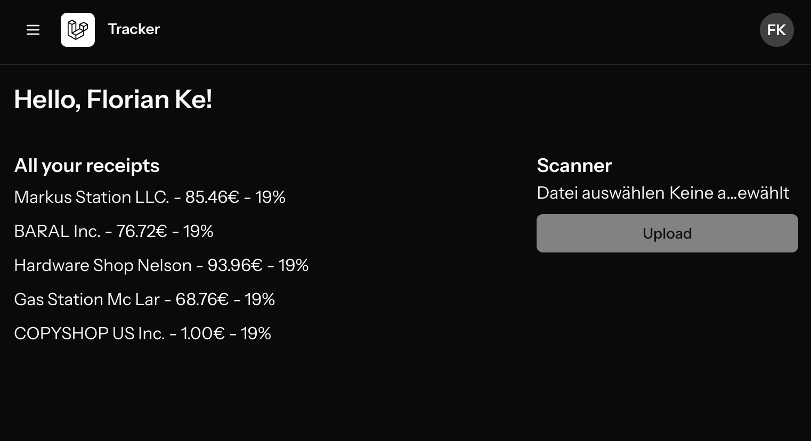

# Receipt Tracker

Ein einfacher Tracker, der Quittungen mittels OCR ausliest und mit einer KI in das richtige Format bringt.

## Technologien

- **Laravel** - PHP Framework für das Backend
- **Inertia.js** - Verbindet Backend und Frontend nahtlos
- **Vue.js** - JavaScript Framework für das Frontend

## Features

- **OCR Integration**: Automatisches Auslesen von Text aus Quittungen.
- **KI-Formatierung**: Intelligente Aufbereitung der extrahierten Daten.
- **Benutzerfreundliches Interface**: Übersichtliche Darstellung der Ausgaben.

## Todo

- [ ] Bessere Fehlervalidierung implementieren
- [ ] Tests schreiben (Unit & Feature Tests)
- [ ] Verwendung von DTOs 
- [ ] Speicher der Quittungen in einem Laravel storage
